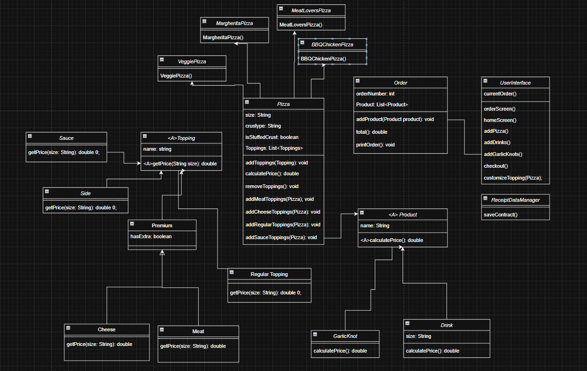

# Slice-It

The Slice It Pizza Ordering System lets users order pizza, drinks, and garlic knots through a menu on the screen.
The main purpose of this program is to let customers build their own pizza or choose a signature pizza, add toppings, and see the total cost. When the order is finished, the program saves a receipt with all the items.
This program is made for anyone who wants an easy way to order pizza and see what they bought.

The Main function of this application:

- Start a new order
- Add items to your order
  - Add a custom pizza 
  - Add a signature pizza 
  - Add drinks 
  - Add garlic knots
- Customize a pizza
  - Choose size 
  - Choose crust 
  - Add toppings 
  - Add extra toppings 
  - Remove toppings
- View your current order
- See the total price
- Checkout and create a receipt
  - Receipt includes all items 
  - Shows total cost 
  - Saves receipt with date and time
- Cancel an order

## User Stories

- As a user, I want to build my own pizza by choosing the size, crust type, and toppings, so I can customize my order exactly how I like it.
- As a user, I want to add garlic knots and drinks to my order, so I can complete my meal in one checkout.
- As a user, I want to see a summary of my order showing each item and its price, so I can check everything before buying.
- As a user, I want to see the total price of my order (including pizzas, sides, and drinks), so I know how much I need to pay before checking out.
- As a user, I want to add premium toppings like extra cheese or meat, so I can upgrade my pizza with additional flavor for an extra cost.
- As a user, I want the system to save my order details to a receipt, so I can have a record of what I purchased.

## Setup

### Prerequisites

- IntelliJ IDEA: Ensure you have IntelliJ IDEA installed, which you can download from [here](https://www.jetbrains.com/idea/download/).
- Java SDK: Make sure Java SDK is installed and configured in IntelliJ.

### Running the Application in IntelliJ

Follow these steps to get your application running within IntelliJ IDEA:

1. Open IntelliJ IDEA.
2. Select "Open" and navigate to the directory where you cloned or downloaded the project.
3. After the project opens, wait for IntelliJ to index the files and set up the project.
4. Find the main class with the `public static void main(String[] args)` method.
5. Right-click on the file and select 'Run 'Main.java' to start the application.

## Technologies Used

- Java 17
- IntelliJ Idea.

## Demo

- 

## Class Diagram

## Resources

- [java cheatsheet](https://quickref.me/java)
- [Dates and Times](https://docs.oracle.com/javase/8/docs/api/java/time/LocalDate.html)

## Thanks

- Thank you to Raymond Maroun for helping me with multiple parts of my code.
- Thanks to Rahinur, Zain, and Roger for guidance.
